# PayPulse RecoveryOps — Architecture

## System goal

PayPulse is a merchant-level control plane above a payment provider. It does not try to replace network-scale routing or retry models. It detects payment incidents, discovers the affected cohort, estimates the incremental value of permitted recovery actions, executes through a bounded adapter, and records proof.

```mermaid
flowchart LR
    A[Razorpay webhooks / synthetic stream] --> B[Event normalizer]
    B --> C[Temporal incident detector]
    C --> D[Automated cohort slice finder]
    D --> E[Root-cause evidence engine]
    E --> F[Per-action outcome models]
    F --> G[Causal uplift scorer]
    G --> H[Consent and policy gate]
    H --> I[Razorpay / notification adapter]
    I --> J[Outcome attribution]
    J --> K[Recovery proof ledger]
    K --> L[Merchant dashboard]
```

## Components

### 1. Event normalizer

Canonical event fields include payment/customer ID, timestamp, amount, payment method, PSP, bank, device, status, error code, consent, contact count, attempt count and subscription status. No raw card credentials are stored.

### 2. Incident detector

The MVP compares the latest eight-hour window with the previous 24-hour baseline. It searches one-, two- and three-dimensional slices over payment method, PSP, bank and device. Candidate score rewards failure-rate change, support and specificity.

### 3. Root-cause engine

The selected cohort's error distribution is compared with baseline. The result contains an evidence list, hypothesis, confidence, blast radius and rupees at risk. Gemini is optional and only summarizes computed evidence.

### 4. Action uplift models

A T-learner trains one logistic outcome model per action on randomized logged interventions:

- no action
- retry after 30 minutes
- send payment link
- recommend alternate method

For action `a`, estimated uplift is `P(recovery | a,x) - P(recovery | no action,x)`.

### 5. Constrained policy

The policy maximizes:

`amount × estimated uplift − action cost − friction penalty − risk penalty`

Deterministic gates block non-transient retries, exhausted retry counts, opted-out outreach and exhausted contact budgets. High-value or lower-confidence decisions require merchant approval.

### 6. Evaluation

Data is split chronologically 75/25. Since historical synthetic actions were randomized at propensity 0.25, the holdout policy is evaluated with inverse propensity scoring. Bootstrap resampling produces a 95% interval. Current-batch recovery is a model estimate and is always labelled synthetic.

### 7. Execution boundary

The adapter runs in mock mode without credentials and real Razorpay test mode with an `rzp_test_` key. Approved payment-link actions create hosted Razorpay Payment Links; delayed retries are scheduled rather than directly debited. Payment status is closed through a signed webhook or server-side Payment Link status check. The execution route is deliberately separated from the model and retains idempotency, signature checks and merchant approval rules.

## Trust boundaries

- The LLM cannot execute money actions.
- Financial calculations and policy gates are deterministic.
- API secrets remain server-side.
- Every action references an incident and evidence record.
- Duplicate execution requests return an idempotent replay.
- Production deployment must use a durable database and queue rather than the MVP in-memory store.
